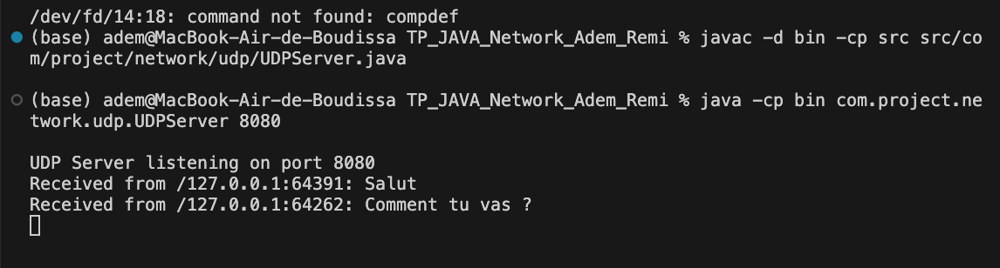
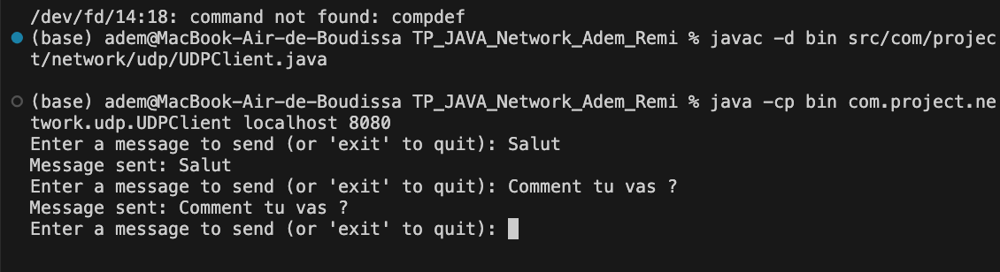
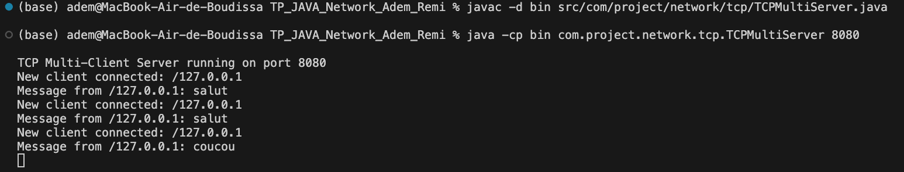
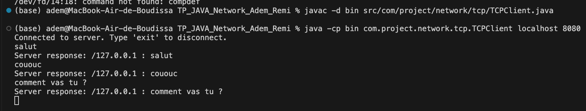
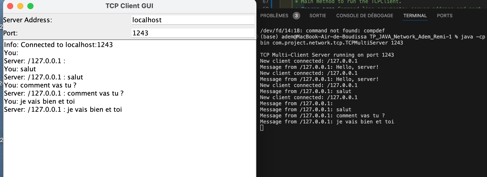

TP_JAVA_NETWORK_ADEM_REMI

Description :

This project, written in Java, explores network communication using the TCP and UDP protocols. It includes clients, servers, and a graphical user interface to interact with certain network features. The components are tested using JUnit 5 to ensure proper functionality.

Some results : 

For the UDP connection :

For the TCP connection :

For the interface TCPClientGUI : 

## Getting Started

Welcome to the VS Code Java world. Here is a guideline to help you get started to write Java code in Visual Studio Code.

## Folder Structure

The workspace contains two folders by default, where:

- `src`: the folder to maintain sources
- `lib`: the folder to maintain dependencies

Meanwhile, the compiled output files will be generated in the `bin` folder by default.

> If you want to customize the folder structure, open `.vscode/settings.json` and update the related settings there.

## Dependency Management

The `JAVA PROJECTS` view allows you to manage your dependencies. More details can be found [here](https://github.com/microsoft/vscode-java-dependency#manage-dependencies).

